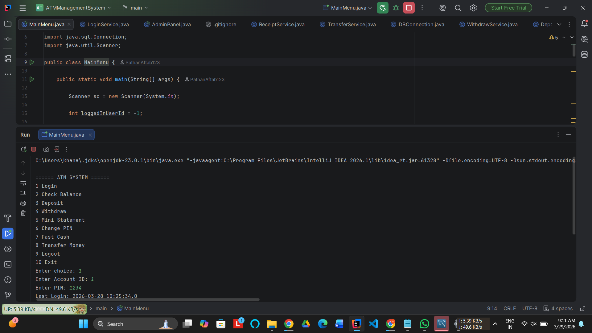
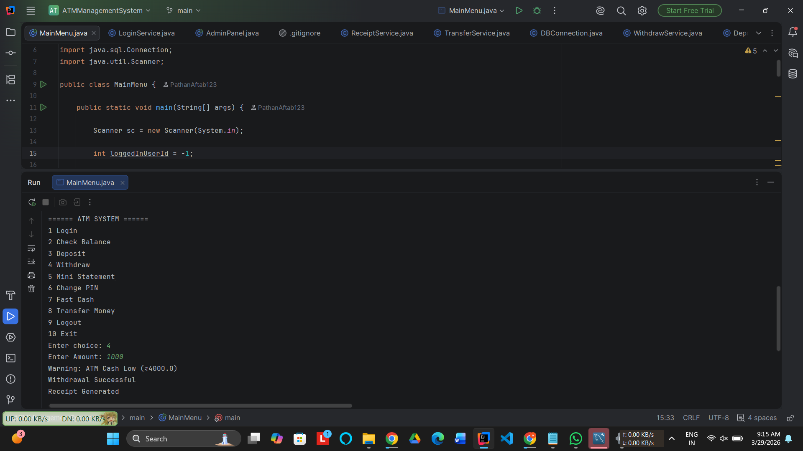
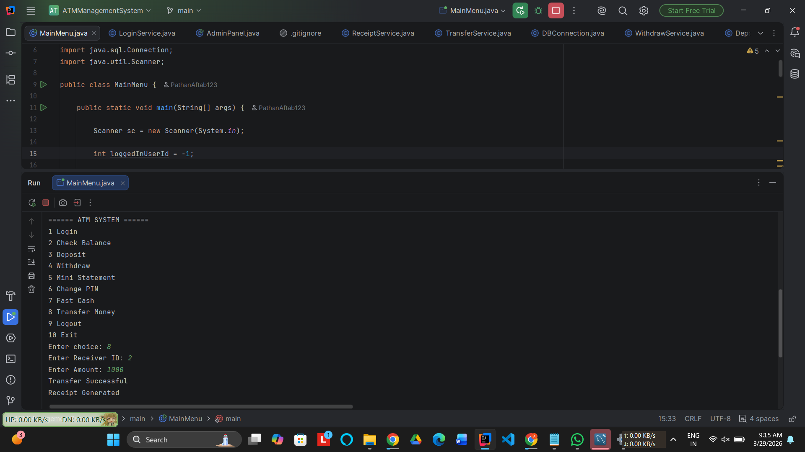

# 🏧 ATM Management System (Java + JDBC + MySQL)

## 📌 Project Overview

ATM Management System is a console-based Java application that simulates real-world ATM operations.  
This project is built using **Core Java, JDBC, and MySQL**, and follows a modular service-based architecture.

It allows users to perform secure banking operations such as:

- Login with PIN  
- Deposit Money  
- Withdraw Money  
- Transfer Money  
- Change PIN  
- Generate Mini Statement  
- Generate Transaction Receipt  

---

## 🚀 Technologies Used

- Java (Core Java)
- JDBC (Java Database Connectivity)
- MySQL Database
- IntelliJ IDEA
- Git & GitHub

---

## ✨ Features

### 👤 User Features

- Secure Login with PIN  
- Account Lock after 3 wrong attempts  
- Check Balance  
- Deposit Money  
- Withdraw Money  
- Fast Cash Withdrawal  
- Transfer Money  
- Change PIN  
- Mini Statement (Last 5 Transactions)  
- Receipt Generation  
- Daily Withdrawal Limit (₹10000)

---

### 🏧 ATM Features

- ATM Cash Availability Check  
- Low Cash Warning  
- Automatic ATM Cash Reduction  
- Transaction Logging  
- Receipt File Generation  

---

### 🔐 Security Features

- PIN Authentication  
- Account Lock after 3 failed login attempts  
- Daily Withdrawal Limit  
- Database transaction handling (Commit/Rollback)

---

## 🗂️ Project Structure

```
atm-management-system-java
│
├── src
│   ├── main
│   │   └── MainMenu.java
│   │
│   ├── db
│   │   └── DBConnection.java
│   │
│   ├── service
│   │   ├── DepositService.java
│   │   ├── WithdrawService.java
│   │   ├── TransferService.java
│   │   ├── BalanceService.java
│   │   ├── PinService.java
│   │   ├── MiniStatementService.java
│   │   ├── ReceiptService.java
│   │   └── ATMService.java
│   │
│   └── admin
│       └── AdminPanel.java
│
├── mini_statement.txt
├── transaction_receipt.txt
└── README.md
```

---

## 🗄️ Database Setup

### Step 1: Create Database

```sql
CREATE DATABASE atmdb;
USE atmdb;


CREATE TABLE accounts (
    id INT PRIMARY KEY AUTO_INCREMENT,
    name VARCHAR(50),
    balance DOUBLE,
    pin INT,
    failed_attempts INT DEFAULT 0,
    account_locked BOOLEAN DEFAULT FALSE,
    last_login TIMESTAMP
);


CREATE TABLE transactions (
    id INT PRIMARY KEY AUTO_INCREMENT,
    account_id INT,
    type VARCHAR(50),
    amount DOUBLE,
    date TIMESTAMP DEFAULT CURRENT_TIMESTAMP
);


CREATE TABLE atm_cash (
    id INT PRIMARY KEY,
    total_cash DOUBLE
);

INSERT INTO atm_cash VALUES (1, 50000);
```


## ▶️ How to Run the Project

### Clone the repository

```bash
git clone https://github.com/PathanAftab123/atm-management-system-java.git
```

### Steps to Run

1. Open project in IntelliJ IDEA  
2. Configure MySQL database  
3. Update database credentials in  
   `DBConnection.java`  
4. Run  
   `MainMenu.java`
## 📄 Sample Output

```
====== ATM SYSTEM ======

1 Login
2 Check Balance
3 Deposit
4 Withdraw
5 Mini Statement
6 Change PIN
7 Fast Cash
8 Transfer Money
9 Logout
10 Exit

Enter choice:


```
## 🎯 Learning Outcomes

Through this project, I learned:

- JDBC Database Connectivity  
- Transaction Management (Commit/Rollback)  
- Service-Based Architecture  
- SQL Query Handling  
- File Handling in Java  
- Exception Handling  
- Real-world ATM Logic Implementation

  
## 📌 Future Enhancements

- GUI version using Java Swing  
- Web version using Spring Boot  
- OTP verification  
- Email notifications  
- Admin dashboard improvements

  
## 👨‍💻 Author

**Aftab Khan**

- GitHub: https://github.com/PathanAftab123


⭐ If you like this project

Give it a ⭐ on GitHub!


---
## 📸 Screenshots

### 🔐 Login Screen



---

### 💸 Withdraw Money



---

### 🔁 Transfer Money



---
